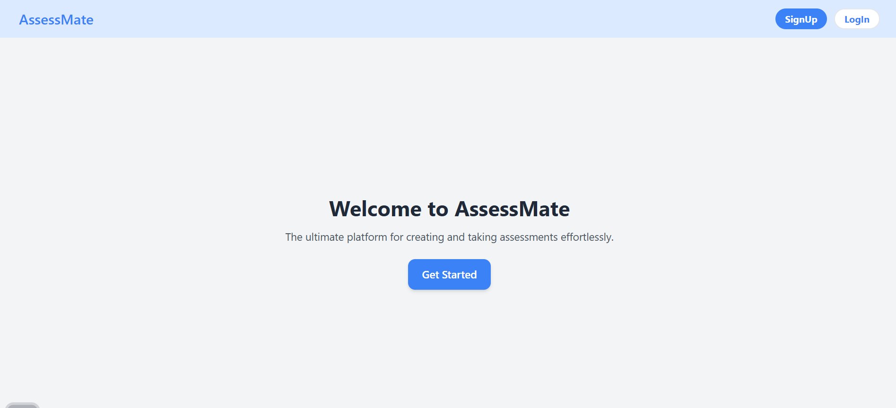
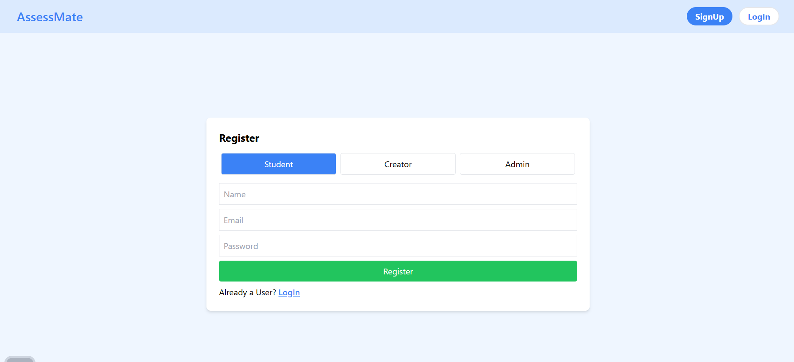
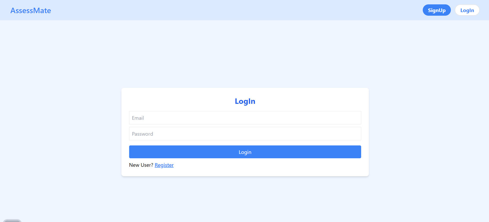
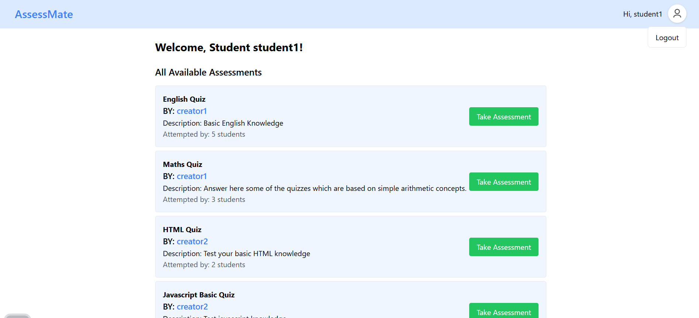
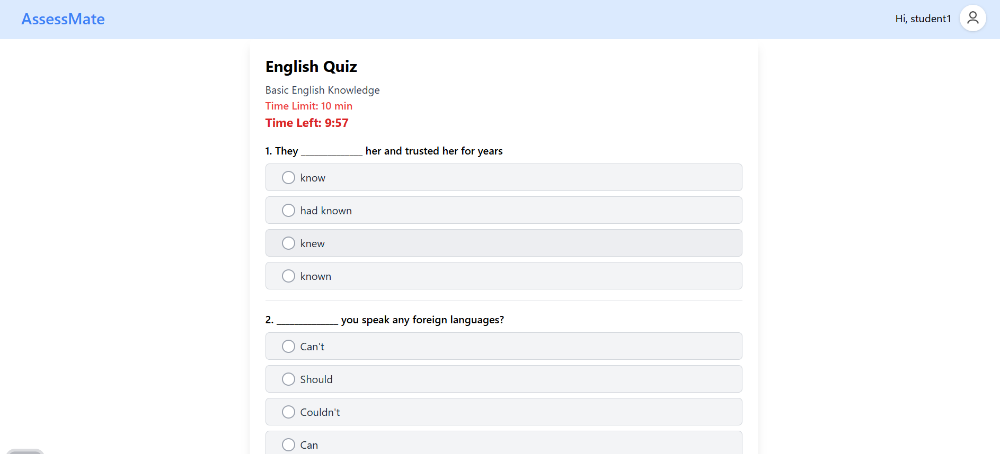
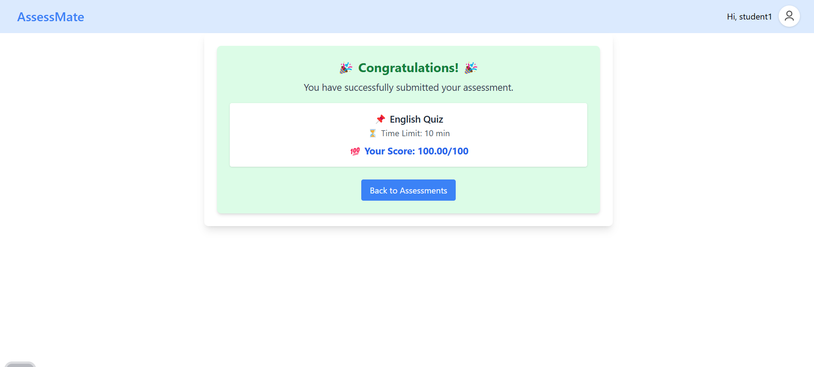
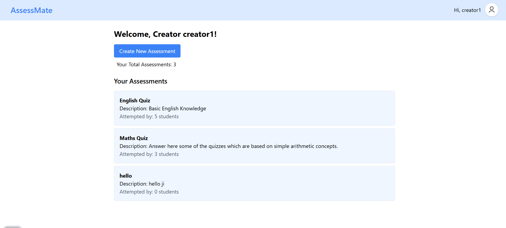
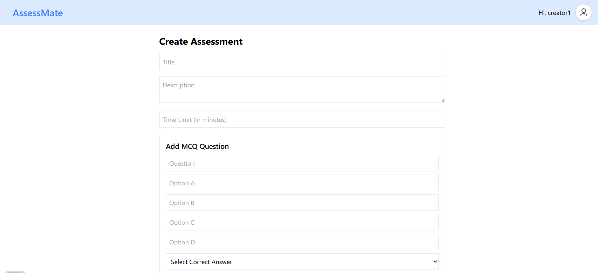
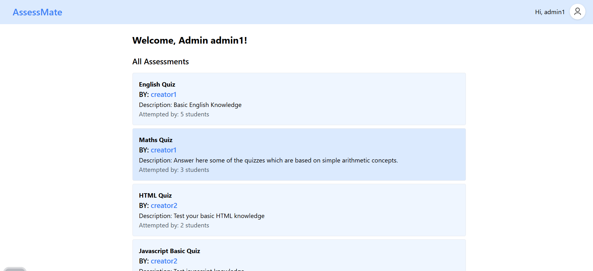
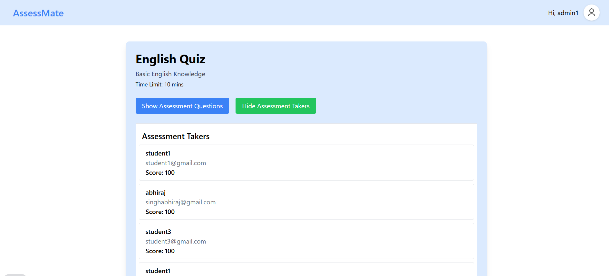

# 📝 AssessMate - Online Assessment Platform  

**AssessMate** is a full-stack web application designed for **MCQ-based online assessments**. It allows admins, educators, and students to interact seamlessly, making test-taking, result analysis, and report generation effortless.  

## 🚀 Features  
**Admin Panel** - Manage assessments and track student performances.  
**Assessment Creators** - Create, share, and review assessments.  
**Students** - Attempt assessments, receive instant scores.  
**Secure Authentication** - JWT-based authentication with role-based access control.  
**Automated Email Reports** - Students get detailed score reports after submission.  
**Real-time Updates** - Assessments dynamically update with new attempts.  
**Mobile & Web Friendly** - Modern UI with React & Tailwind CSS.  

## Tech Stack  
- **Frontend**: React (Vite) + Tailwind CSS  
- **Backend**: Node.js + Express.js  
- **Database**: MongoDB (Mongoose ORM)  
- **Authentication**: JWT (JSON Web Tokens) + bcrypt  
- **State Management**: Context API  












## 📁 Folder Structure  
```
📂 AssessMate
├── 📁 backend
│   ├── 📁 config (Database & env variables)
│   ├── 📁 controllers (Business logic)
│   ├── 📁 models (Mongoose Schemas)
│   ├── 📁 routes (API Endpoints)
│   ├── 📁 middleware (Auth, Validation)
│   ├── 📁 utils (Helper functions)
│   ├── server.js (Main backend file)
│
├── 📁 frontend
│   ├── 📁 src
│   │   ├── 📁 components (Reusable UI Components)
│   │   ├── 📁 pages (Routes like Dashboard, Assessments)
│   │   ├── 📁 context (Global state management)
│   │   ├── 📁 services (API Calls)
│   │   ├── 📁 assets (Images, Icons)
│   │   ├── main.jsx (React entry file)
│   │   ├── App.jsx (Main App)
│   │
├── .env (Environment variables)
├── package.json (Dependencies)
├── README.md (Project Documentation)
```

## How to Run Locally  

### 1. Clone Repository  
```sh
git clone https://github.com/abhiext247/AssessMate.git
cd AssessMate
```

### 2️. Install Dependencies  
```sh
# Install backend dependencies
cd backend
npm install

# Install frontend dependencies
cd ../frontend
npm install
```

### 3️. Configure Environment Variables  
Create a `.env` file inside **backend/** and add:  
```env
MONGO_URI=your_mongodb_uri
JWT_SECRET=your_secret_key
EMAIL_SERVICE=your_email_service
EMAIL_USER=your_email
EMAIL_PASS=your_email_password
```

### 4️. Run the Application  
```sh
# Start backend server
cd backend
npm start

# Start frontend
cd ../frontend
npm run dev
```
The app should now be running at `http://localhost:5173`  


---

**Happy Coding!** Made with ❤️ by [Abhiraj](https://github.com/abhiext247)
